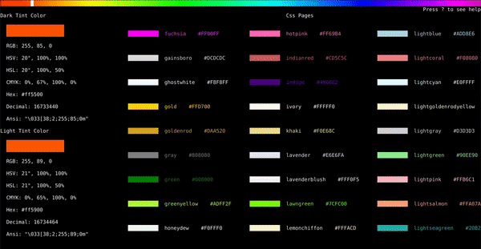

# Cpick

An extensive color picker in the terminal.

---

## Dependencies

Cpick depends on [Tcell](github.com/gdamore/tcell) and [Colors](gitlab.com/ethanbakerdev/colors).

Cpick also uses [Cview](gitlab.com/tslocum/cview). However, Cview currently has a feature where the table cells are drawn with a required space in between cells, which ruins the aesthetic of Cpick. In order to fix this, a forked version of Cview is used within the Cpick package that has the required fixes. This may lead to bugs and issues in older versions of Cview that are not able to be readliy fixed until Cview adopts required features.

---

## Installation

#### Golang 

To include the Cpick package, include the line `import "gitlab.com/ethanbakerdev/cpick"`.

To make a command based off of the package, run `go install` in the `cmd/cpick` directory. Command usage can be found in the [docs](https://godoc.org/gitlab.com/ethanbakerdev/cpick).

#### Arch Linux (Arch User Repository)

Visit the [AUR page](https://aur.archlinux.org) to download Cpick to your arch system. If you don't know how to download a package from the Arch User Repository, you can follow directions from the [Arch wiki](https://wiki.archlinux.org/index.php/Arch_User_Repository#Installing_packages).

#### Ubuntu/Debian

Coming soon!

---

## Documentation

[Documentation](https://godoc.org/gitlab.com/ethanbakerdev/cpick) is present using Godoc.

---

## Features

#### Cpick Settings

Cpick comes with two boolean settings: sandbox and testing.

* Sandbox

Sandbox determines whether or not Cpick will return a color. Sandbox is useful for looking at colors that will be used somewhere else, like for a website. If sandbox is set to `true`, Cpick will not return any value but will instead cycle between different color tables. Setting sandbox to `false` means a color will be returned. 

* Testing

Testing is used to test coverage and validness of Cpick without requiring user input. Testing is useful for making sure Cpick can work on your device. Setting testing to `true` turns on the test mode, while setting testing to `false` keeps cpick on normal mode.

All of the tests can be found in the [tests.go](https://gitlab.com/ethanbakerdev/cpick/-/blob/master/tests.go) file (COMING SOON).

#### Controls/Keys

If you are looking for a simplified version, check out the [docs](https://gitlab.com/ethanbakerdev/cpick/-/blob/master/colors.go). Here is a more in-depth explanation.

You can also see a minified help version by pressing \` while the Cpick application is running.

In Cpick, there are two main screens: the **hue screen** and the **saturation-value screen**.

The **hue screen** is the first screen that pops up. It contains a hue slider present at the top, two color tint previews on the left, and a table of different preset or custom colors at the bottom.

The **saturation-value screen** is the screen that pops up once you press enter to select a color on the **hue screen**. It contains one large color gradient in the center and two color tint previews on the right.

On the **hue screen**, you initially start off on the hue slider. This is where you can select a specific hue by navigating the table, either using h and l (from vim) or the left and right arrow. If you press enter, you will be moved to the **saturation-value** screen with the table representing the hue you chose. You can also press space to move to the listed colors at the bottom of the **hue screen**.

For the listed color table on the **hue screen**, you can navigate it using the standard vim keys (h, j, k, l) or the arrow keys. If you press enter on a selected color, you will be taken to the **saturation-value screen** and the color you selected will automatically be selected on the big color gradient table. You can also switch between color types by pressing c to go forward a page and C to go back.

In addition, you can press ? to open up a search menu. Here you can search for a specific color or keyword. You can press N to go to the next selection and n to go to the previous selection, just like in vim. 

On the **saturation-value screen**, you can move about the screen using the standard vim keys (h, j, k, l) or the arrow keys. Once on a desired color, press enter to select it (take note that if you ran Cpick with sanbox as true, pressing enter on the table will take you back to the **hue screen**).

In addition, you can press g to go to the start of the table (top-left most cell) or G to go to the end of the table (bottom-right most cell).

#### Custom Colors

In Cpick, you can add custom colors that can come up on the color pages. You can add json files that hold the colors in 3 ways.

1. **Local Environment**

Wherever you are running Cpick, you can provide a local `colors.json` file (file would have the path `./colors.json` from wherever cpick is being run). This has the highest priority.

2. **~/.config Directory**

In the `~/.config` directory, you can create a `cpick` directory that can contain the `colors.json` file (file would have the path `~/.config/cpick/colors.json`). This has a lower priority than a local file but a higher priority than a `./cpick` directory..

3. **~/.cpick Directory**

In your home directory, you can create a `.cpick` directory that can contain the `colors.json` file (file would have the path `~/.cpick/colors.json`). This has the lowest priority.

The `colors.json` has a very strict format. 

~~~json
{
  "colorList": [
    {
      "name": "COLOR NAME 1",
      "colors": []
    },

    {	
      "name": "COLOR NAME 2",
      "colors": []
    },

    {	
      "name": "COLOR NAME 3",
      "colors": []
    }

  ]
}
~~~

Each color type consists of an object with a `name` and `colors` key. The `name` key consists of what color type the colors provided are, such as CSS, Solarized, or XTERM. The `colors` key holds all of the colors that will be previewed when Cpick is run. All of the different color types are in the `colorList` array.

An individual color is an object that consists of two keys: `name` and `value`. `name` is the name of the color and `value` is the hexadecimal value of the color as a string. The "#" for the hexadecimal value is optional.

~~~json
"colors": [
  {"name": "Red",   "value": "#FF0000"},
  {"name": "Green", "value": "#00FF00"},
  {"name": "Blue",  "value": "#0000FF"}
]
~~~

Cpick comes with three color types as a default: CSS, Solarized, and XTERM. In order to fix complicated import problems, the json data is present in the [colors.go](https://gitlab.com/ethanbakerdev/cpick/-/blob/master/colors.go) file as a string. The preset data always has the lowest priority for being used.

---

## Issues, Suggestions, and Patches

For issues and suggestions, please include as much useful information is possible. Make sure the issue is actually present or the suggestion is not inculded.

For patches, please submit them as pull requests.
